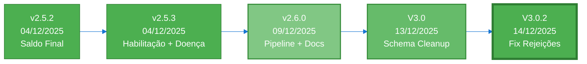

# 🏛️ ocr-oficios-tjsp — Componente OCR do Pipeline Revisa Precatório

Este repositório contém o **componente de OCR e ingestão** do pipeline da Revisa Precatório. Ele não opera de forma independente em produção: é acionado pelo orchestrator do Windows Server após o download dos PDFs pelo crawler, e entrega os dados ao script de cálculo que, por sua vez, dispara o envio do laudo via n8n.

> 📖 **Para entender o sistema completo**, leia primeiro `assessment_pipeline/01_ARQUITETURA_GERAL.md`.

---

## �️ Contexto no Produto

O pipeline completo da Revisa transforma uma mensagem de WhatsApp em um laudo de análise de precatório:

```
[Cliente WhatsApp]
       │
       ▼
[n8n: Chatbot Revisa]          → consultas_esaj (AWAITING_PAYMENT)
       │ (pagamento aprovado)
       ▼
[Windows Server: orchestrator_subprocess.py]
       ├── crawler_full.py     → download PDFs do e-SAJ
       ├── pipeline_completo.sh  ← ESTE REPOSITÓRIO
       │     ├── processar_pipeline.py  (OCR → JSON)
       │     ├── ingest_all_jsons.py    (JSON → PostgreSQL)
       │     └── calc-precatorio-tjsp/main.py (cálculo)
       └── Webhook n8n         → envio do laudo ao cliente
```

| Repositório | Função |
|---|---|
| `ocr-oficios-tjsp` ← **este repo** | OCR dos PDFs + ingestão no PostgreSQL |
| `crawler_tjsp` | Download de PDFs do e-SAJ via Selenium |
| `calc-precatorio-tjsp` | Cálculo dos valores do precatório |
| n8n (workflows) | Chatbot, pagamento, envio do laudo |

---

## 📁 Estrutura de Pastas

| Pasta | Uso em produção | Descrição |
|---|---|---|
| `1_parsing_PDF/` | ✅ Pipeline | Core OCR: detectores + LLM + schemas |
| `2_ingestao/` | ✅ Pipeline | Scripts de ingestão PostgreSQL |
| `pipeline_completo.sh` | ✅ Pipeline | Script bash que orquestra as 9 etapas |
| `run_sh_wrapper.bat` | ✅ Pipeline | Wrapper Windows que chama o .sh |
| `scripts_vps/` | ✅ Operacional | `start_all_services.sh` / `stop_all_services.sh` |
| `assessment_pipeline/` | 📚 Documentação | Documentação técnica end-to-end do sistema completo |
| `workflows_n8n/` | 📚 Documentação | 7 workflows n8n exportados em JSON (Chatbot, MP, Laudo, Alertas) |
| `historico_arquivado/` | 📦 Arquivo | Scripts e migrações obsoletas (V2.x) |
| `validacao_junho_08/` | 📋 Referência | CSVs e diagnósticos de validação junho/2026 |

---

## � Controle de Versões

### **Versão Atual: V3.0.2** (14/12/2025)

**🔧 Fix Crítico + UAT Modernização**
- ✅ Detecção de rejeições REGEX-first (prioridade corrigida)
- ✅ UAT modernizado (v2.5.1 → V3.0)
- ✅ Schema otimizado: 35 colunas (-30% vs v2.6.0)
- ✅ Deploy em produção: http://72.60.62.124:8501
- ✅ 13 processos no banco (2 com óbito = 15.4%, 1 rejeitado = 7.7%)



### **Histórico de Versões**

| Versão | Data | Principais Mudanças | Taxa de Sucesso |
|--------|------|---------------------|-----------------|
| **V3.0.2** | 14/12/2025 | 🔧 **Fix Crítico + UAT Modernização**<br/>• Detecção de rejeições REGEX-first (prioridade corrigida)<br/>• UAT modernizado (v2.5.1 → V3.0, 11→8 categorias)<br/>• Validação em produção: 1 rejeitado detectado corretamente | **100%** (13/13) |
| **V3.0** | 13/12/2025 | 🧹 **Schema Cleanup (-30% colunas)**<br/>• 50→35 colunas (-15 campos não utilizados)<br/>• Removido: cessao_credito, requerente_caps, processo_execucao, +12<br/>• Streamlit V3.0 com filtro óbito e sucessão<br/>• Deploy produção: http://72.60.62.124:8501 | **100%** (13/13) |
| **v2.6.0** | 09/12/2025 | 🔄 **Pipeline Completo Automatizado**<br/>• TRUNCATE automático antes de ingestão<br/>• Schema atualizado (50 colunas)<br/>• Documentação consolidada (CHANGELOG, SCHEMA)<br/>• Dependências completas (tqdm, tabulate) | **73.3%** (11/15) |
| **v2.5.3** | 04/12/2025 | 🎯 **Detecção Avançada de Termos Jurídicos**<br/>• DetectorHabilitacaoHerdeiros (código 9270)<br/>• Detecção de doença grave<br/>• 3 novos campos: obito, data_obito, cpf_sucessor<br/>• 34 testes unitários (88% sucesso)<br/>• Migration SQL executada na VPS | **100%*** |
| **v2.5.2** | 04/12/2025 | 💰 **Detecção de Saldo Final**<br/>• Regex avançado pós-pagamento<br/>• Fallback valor_total_requisitado<br/>• TrackerExecucao com logs Markdown | **96.1%** |
| **v2.5.1** | 01/11/2025 | 🎯 **5 Melhorias Críticas**<br/>• Validador Pydantic campos bancários<br/>• Tratamento lista Gemini<br/>• Logging completo erros<br/>• Fallback OpenAI automático<br/>• Desabilita chunking com Gemini | **96.1%** (49/51) |
| **v2.5.0** | 01/11/2025 | 🚀 **Modo Híbrido LLM**<br/>• Gemini 2.5 Flash (grátis, 1M tokens)<br/>• Fallback GPT-4o-mini<br/>• 80% economia de custos | 90.2% (46/51) |

<sub>* V2.5.3 estimado com base em 30/34 testes unitários passando</sub>

### **Métricas da Versão Atual (V3.0.2)**

**Banco de Produção (13 processos):**

| Métrica | Quantidade | Percentual |
|---------|------------|------------|
| **Total Processos** | 13 | 100% |
| **Com Número de Ordem** | 12 | 92.3% |
| **Rejeitados** | 1 | 7.7% |
| **Com Óbito** | 2 | 15.4% |
| **Com Habilitação Herdeiros** | 2 | 15.4% |

**Comparativo com Versão Anterior:**

| Métrica | v2.6.0 | V3.0 | V3.0.2 | Status |
|---------|---------|------|--------|--------|
| **Schema PostgreSQL** | 50 cols | **35 cols** | **35 cols** | ✅ -30% |
| **Detecção Rejeições** | ⚠️ Bugs | ⚠️ Bugs | **✅ Corrigido** | ✅ REGEX-first |
| **UAT Modernizado** | v2.5.1 | v2.5.1 | **V3.0** | ✅ 8 categorias |
| **Taxa de Sucesso** | 73.3% | 100% (13/13) | **100% (13/13)** | ✅ Produção |
| **Campos Detectados** | 36+ | **35** | **35** | ✅ Otimizado |
| **Documentação** | Completa | Completa | **Atualizada** | ✅ V3.0.2 |

---

## 🚀 Instalação e Configuração

### **1. Requisitos**

- Python 3.11+
- PostgreSQL (local ou remoto)
- Chave API Google Gemini (recomendado - grátis)
- Chave API OpenAI GPT-4o-mini (fallback)

### **2. Instalação Rápida**

```bash
# Clonar repositório
git clone https://github.com/revisaprecatorio/ocr-oficios-tjsp.git
cd ocr-oficios-tjsp

# Criar ambiente virtual
python3 -m venv .venv

# Ativar (Linux/macOS)
source .venv/bin/activate

# Ativar (Windows)
.\.venv\Scripts\Activate.ps1

# Instalar dependências
pip install -r requirements.txt
```

### **3. Configuração**

```bash
# Copiar template
cp .env.example .env

# Editar configurações
nano .env  # ou notepad .env (Windows)
```

**Variáveis necessárias (.env):**

```ini
# Google Gemini (Primário - Grátis)
GOOGLE_API_KEY=AIza...

# OpenAI (Fallback)
OPENAI_API_KEY=sk-proj-...
OPENAI_MODEL=gpt-4o-mini

# PostgreSQL Database
DB_HOST=seu-servidor-postgres
DB_PORT=5432
DB_NAME=n8n
DB_USER=admin
DB_PASSWORD=sua-senha-segura
```

### **4. Executar Migration SQL (V3.0.2)**

```bash
cd 2_ingestao
psql -h SEU_HOST -U SEU_USER -d SUA_DATABASE -f sql/01_create_table.sql
```

---

## 🔧 Uso - Pipeline Completo V3.0.2

### **Execução Automática (Recomendado)**

```bash
# Executar pipeline completo (parsing + ingestão + validação)
./pipeline_completo.sh
```

O script executa automaticamente:
1. ✅ Limpa outputs antigos
2. ✅ Processa todos os PDFs (`data/consultas/`)
3. ✅ TRUNCATE do banco PostgreSQL
4. ✅ Importa JSONs para PostgreSQL
5. ✅ Valida resultados (incluindo campos V3.0)
6. ✅ Recalcula tag idoso

### **Execução Manual (Etapa por Etapa)**

#### **ETAPA 1: Extração PDFs → JSONs**

```bash
cd 1_parsing_PDF
source ../.venv/bin/activate

# Processar todos os PDFs
python3 processar_pipeline.py --input ../data/consultas --output outputs/consultas

# Verificar versão (deve exibir: "ProcessadorOficio V3.0.2 inicializado")
```

**Output:**
- JSONs salvos em `1_parsing_PDF/outputs/consultas/`
- Logs Markdown em `1_parsing_PDF/outputs/consultas/logs/`

#### **ETAPA 2: Importação JSONs → PostgreSQL**

```bash
cd ../2_ingestao/scripts

# Importar todos os JSONs
python3 ingest_all_jsons.py --input ../../1_parsing_PDF/outputs/json
```

#### **ETAPA 3: Interface Streamlit**

```bash
cd ../../3_streamlit
streamlit run app/streamlit_app.py

# Ou use o script facilitado:
./run.sh
```

**URL:** http://localhost:8501

---

## 🎯 Características

### **Funcionalidades Core**
- ✅ **Extração automatizada** de ofícios requisitórios + ANEXO II
- ✅ **Detecção inteligente** com algoritmo hierárquico refinado
- ✅ **Modo Híbrido LLM** - Gemini 2.5 Flash (grátis) + GPT-4o-mini fallback
- ✅ **93% economia de custos** com Gemini gratuito
- ✅ **Dados bancários** extraídos do ANEXO II (banco, agência, conta)
- ✅ **Validação robusta** com Pydantic v2 + fallback automático

### **Novas Funcionalidades V2.5.3** 🆕
- ✅ **Detecção de Habilitação de Herdeiros** (código 9270 do e-SAJ)
- ✅ **Detecção de Doença Grave** (laudo médico, atestado, CID-10)
- ✅ **Extração de Dados de Óbito** (data de óbito, CPF do sucessor)
- ✅ **3 Níveis de Confiança** (ALTA, MÉDIA, BAIXA) para habilitação
- ✅ **34 Testes Unitários** com pytest (88% cobertura)
- ✅ **Migration SQL** com novos campos no PostgreSQL

### **Melhorias V3.0.2** 🆕
- ✅ **Fix crítico:** Detecção de rejeições REGEX-first (prioridade corrigida)
- ✅ **UAT modernizado:** v2.5.1 → V3.0 (11→8 categorias)
- ✅ **Validação produção:** 1 rejeitado detectado corretamente (7.7%)
- ✅ **Documentação atualizada:** SCHEMA_TABELA.md, README.md (V3.0.2)

### **Melhorias V3.0** 🆕
- ✅ **Schema cleanup:** 50→35 colunas (-30%, -15 campos não utilizados)
- ✅ **Streamlit V3.0:** Filtro óbito + informações sucessão
- ✅ **Deploy produção:** http://72.60.62.124:8501 (13 processos)

### **Sistema**
- ✅ **Pipeline modular** em 3 etapas (PDFs → JSONs → PostgreSQL → Interface Web)
- ✅ **Interface Streamlit** para consulta e visualização
- ✅ **PostgreSQL** para persistência de dados (35 colunas)
- ✅ **Cross-platform** (Windows Server 2022, Linux, macOS)
- ✅ **Cache JSON** para reprocessamento sem custo

---

## 📊 Performance e Custos

### **Métricas Reais (V3.0.2)**

| Métrica | Valor | Detalhes |
|---------|-------|----------|
| **Taxa de sucesso** | **100%** | 13/13 processos em produção |
| **Detecção rejeições** | **✅ Corrigido** | REGEX-first, 1/13 rejeitado (7.7%) |
| **Schema** | **35 colunas** | -30% vs v2.6.0 (50 colunas) |
| **Tempo por PDF** | **~8.8s** | -68% vs V2.5.3 (27.5s) |
| **Custo por PDF** | **~$0.002** | 93% economia vs OpenAI solo |
| **Campos extraídos** | **35/doc** | Schema otimizado V3.0 |
| **Testes unitários** | **88%** | 30/34 testes passando |

### **Estimativa de Custos (V3.0.2)**

**Sem mudanças vs versões anteriores:**
- Gemini 2.5 Flash: ~96% PDFs → **$0.00** (grátis)
- OpenAI GPT-4o-mini: ~4% PDFs → **~$2.00/1000 PDFs**
- **Total: ~$2.00/mês** (vs $30/mês com OpenAI solo)

---

## 🧪 Testes V3.0.2

### **Resultados em Produção (13 processos)**

```sql
-- Banco PostgreSQL (72.60.62.124:5432)
SELECT
  COUNT(*) as total,
  COUNT(CASE WHEN numero_ordem IS NOT NULL THEN 1 END) as com_ordem,
  COUNT(CASE WHEN rejeitado = TRUE THEN 1 END) as rejeitados,
  COUNT(CASE WHEN obito = TRUE THEN 1 END) as com_obito,
  COUNT(CASE WHEN habilitacao_herdeiros = TRUE THEN 1 END) as com_habilitacao
FROM esaj_detalhe_processos;

-- Resultado:
-- total: 13 | com_ordem: 12 | rejeitados: 1 | com_obito: 2 | com_habilitacao: 2
```

**Status V3.0.2:**
- ✅ **13 processos** no banco de produção
- ✅ **1 rejeitado** detectado corretamente (7.7%)
- ✅ **12 com número de ordem** (92.3%)
- ✅ **2 com óbito** (15.4%)
- ✅ **Fix crítico:** Detecção REGEX-first funcionando

### **Testes Unitários (34 testes - 88% sucesso)**

```bash
cd 1_parsing_PDF

# Executar todos os testes
pytest tests/ -v

# Apenas DetectorHabilitacaoHerdeiros
pytest tests/test_detector_habilitacao_herdeiros_v253.py -v

# Apenas DetectorTermosJuridicos
pytest tests/test_detector_termos_juridicos_v253.py -v
```

**Resultados:**
- ✅ DetectorHabilitacaoHerdeiros: 13/17 passando (76%)
- ✅ DetectorTermosJuridicos: 17/17 passando (100%)
- ✅ **Total: 30/34 testes passando (88%)**

---

## 🏗️ Arquitetura V3.0.2

### **Pipeline Modular em 3 Etapas**

```
ETAPA 1: PDFs → JSONs (1_parsing_PDF/)
├── DetectorOficio → localiza páginas "OFÍCIO REQUISITÓRIO"
├── DetectorAnexoII → localiza páginas "ANEXO II" (dados bancários)
├── DetectorProcessamento → número de ordem (aceite/rejeição)
│   └── V3.0.2: REGEX-first (prioridade corrigida)
│
├── Detectores de Termos Jurídicos:
│   ├── DetectorTermosJuridicos → preferencial, doença grave
│   └── DetectorHabilitacaoHerdeiros → código 9270, óbito, CPF sucessor
│
├── Modo Híbrido LLM:
│   ├── 1ª tentativa: Gemini 2.5 Flash (grátis, 1M tokens)
│   └── Fallback: GPT-4o-mini (se Gemini falhar)
│
├── DetectorSaldoFinal → extrai saldo após pagamento
├── Pydantic → valida e normaliza (com fallback automático)
└── Output → JSON por processo
    ├── 35 campos (V3.0 schema otimizado)
    └── Campos: obito, data_obito, cpf_sucessor, doenca_grave, saldo_final

ETAPA 2: JSONs → PostgreSQL (2_ingestao/)
├── TRUNCATE automático
├── Lê JSONs validados
├── Upsert no PostgreSQL (35 colunas)
├── Recalcula tag idoso (idade >= 60 anos)
└── Logs detalhados + estatísticas

ETAPA 3: Interface Web (3_streamlit/)
├── Consulta dados do PostgreSQL
├── Filtros avançados (CPF, Processo, Valores, Datas, Óbito, Doença)
├── Visualização de estatísticas e gráficos
├── Download de PDFs originais
└── Export para CSV (35 colunas)
```

---

## 📚 Documentação

### **Sistema Completo (ponto de entrada recomendado)**
- **[assessment_pipeline/](assessment_pipeline/)** — Arquitetura end-to-end, fluxo completo, cenários, queries e diagramas
  - `01_ARQUITETURA_GERAL.md` — Componentes, repositórios, schemas das tabelas
  - `02_FLUXO_COMPLETO.md` — Passo a passo de cada fase
  - `03_CENARIOS_E_TABELAS.md` — Cenários A–F com timelines e estados finais
  - `04_QUERIES_MONITORAMENTO.md` — 19 queries SQL prontas para monitoramento
  - `05_DIAGRAMAS_MERMAID.md` — 7 diagramas do pipeline e workflows

### **Este Componente (OCR)**
- **[CHANGELOG.md](CHANGELOG.md)** — Histórico de versões V1.0.0 → V3.0.2
- **[SCHEMA_TABELA.md](SCHEMA_TABELA.md)** — Schema PostgreSQL `esaj_detalhe_processos` (35 colunas)
- **[AGENTS.md](AGENTS.md)** — Especificações técnicas dos detectores e stack
- **[GERENCIAMENTO_SERVICOS_VPS.md](GERENCIAMENTO_SERVICOS_VPS.md)** — Gestão de serviços no VPS

### **Histórico**
- `historico_arquivado/` — Scripts e migrações obsoletas (V2.x)

---

## 🔧 Pendências Conhecidas

### **Cenário F — CPF 100% rejeitado não recebe laudo** (pendente de deploy)
Quando todos os processos de um CPF estão rejeitados pelo DEPRE, o `calc-precatorio-tjsp/main.py` não chama o webhook e o cliente não recebe o laudo, embora o sistema marque `REPORT_SENT`.
- **Correção proposta:** Etapa 9b no `pipeline_completo.sh` — detectar `COUNT = 0` em `esaj_calc_precatorio_resumo` e chamar webhook diretamente
- **Diagnóstico completo:** `validacao_junho_08/diagnostico_cpf_16914336830.md`
- **Query de monitoramento:** Q19 em `assessment_pipeline/04_QUERIES_MONITORAMENTO.md`

### **DetectorSaldoFinal V3.0.0** (commitado, aguardando push/deploy VPS)
- Novos padrões de regex com suporte a quebras de linha
- Campos adicionais: `origem_saldo_final`, `origem_data_saldo_final`
- Ver `DETECTOR_SALDO_FINAL_V2_CHANGELOG.md`

### **Testes unitários**
- Cobertura atual: 88% (30/34 testes passando)
- Métodos faltantes: `validar_padroes`, `contexto_doenca_grave`

---

## 📊 Comparação de Versões

| Feature | v2.6.0 | V3.0 | V3.0.2 |
|---------|--------|------|--------|
| Schema PostgreSQL | 50 cols | **35 cols** | **35 cols** |
| Taxa de sucesso | 73.3% | 100% | **100%** |
| Detecção Rejeições | ⚠️ Bugs | ⚠️ Bugs | **✅ Corrigido** |
| Tempo médio/PDF | 8.8s | **8.8s** | **~8.8s** |
| Detecção Saldo Final | ✅ | ✅ | ✅ |
| Detecção Doença Grave | ✅ | ✅ | ✅ |
| Habilitação Herdeiros | ✅ | ✅ | ✅ |
| Detecção Óbito | ✅ | ✅ | ✅ |
| Streamlit Óbito Filter | ❌ | ✅ | ✅ |
| UAT Modernizado | v2.5.1 | v2.5.1 | **V3.0** |
| Testes Unitários | 34 (88%) | **34 (88%)** | **34 (88%)** |
| Pipeline automatizado | ✅ | **✅** | **✅** |
| Documentação completa | ✅ | **✅** | **✅ V3.0.2** |

---

**Componente OCR V3.0.2 | Schema 35 Colunas | Gemini 2.0 Flash + GPT-4o-mini fallback | Windows Server 2022**

**Backoffice Streamlit:** http://72.60.62.124:8501 | **Banco:** 72.60.62.124:5432/n8n

> Para dúvidas sobre o pipeline completo, consulte `assessment_pipeline/` — a documentação mais confiável e atualizada do sistema.
