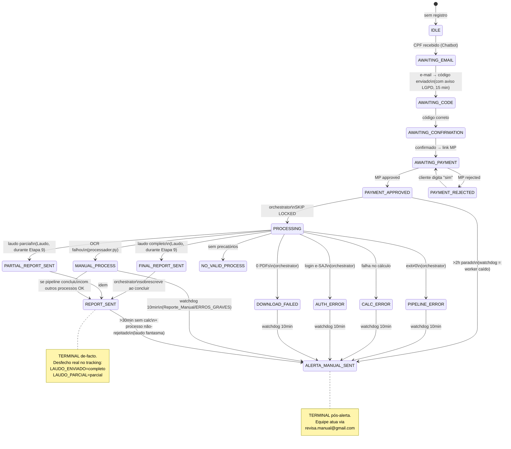
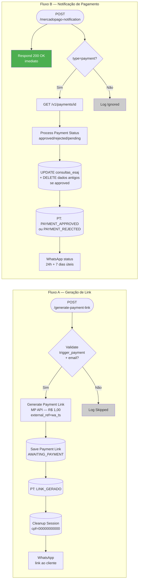
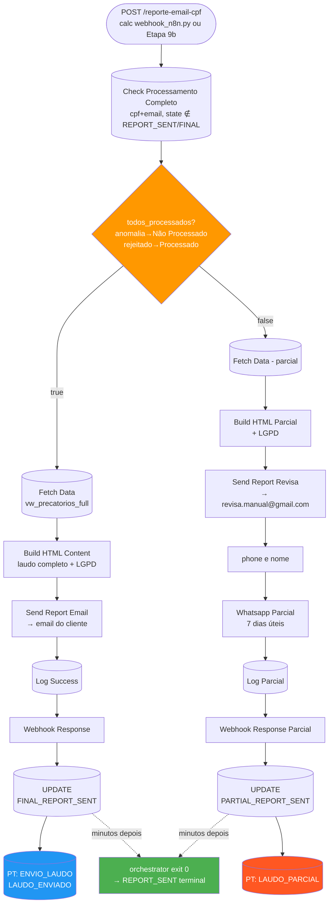
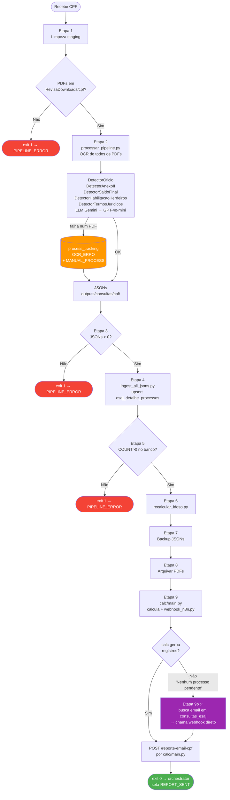
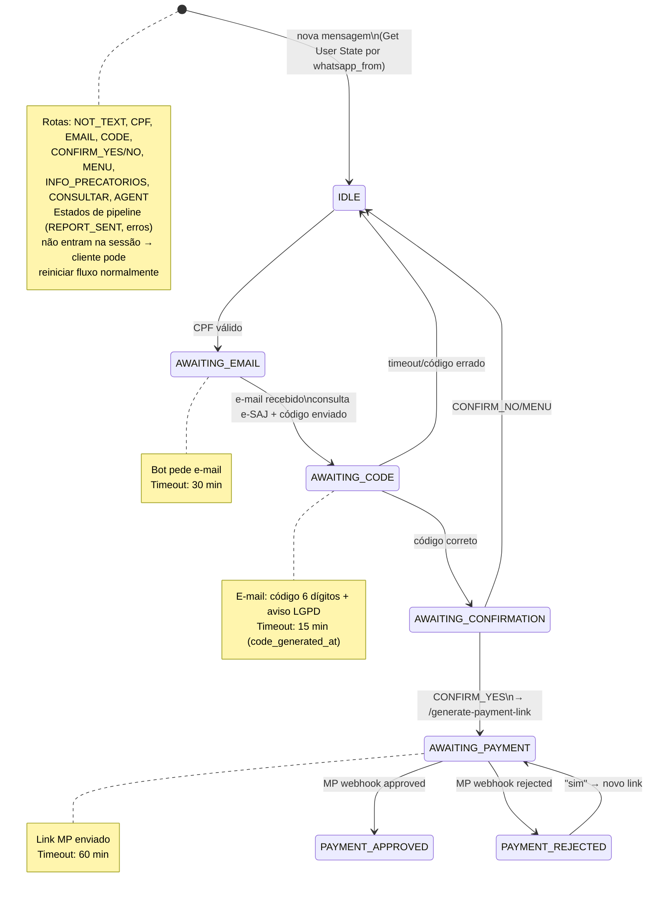
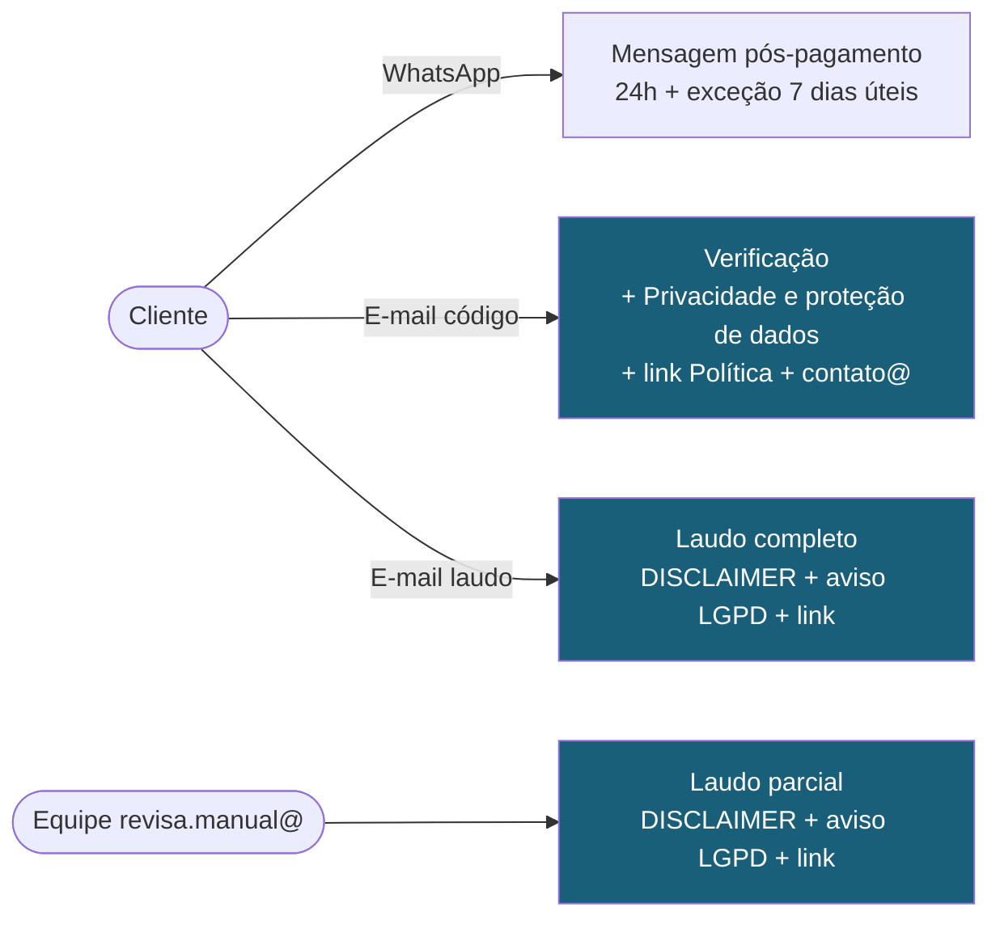

# Diagramas Mermaid — Pipeline Revisa Precatório

**Revisado:** 20/09/2026 — reflete REPORT_SENT terminal, Etapa 9b, watchdog ampliado e destinatários reais.

---

## 1. Pipeline Completo (Ponta a Ponta)

```mermaid
flowchart TD
    A([Cliente WhatsApp]) -->|CPF| B[Chatbot Revisa\nn8n]
    B -->|consulta e-SAJ + email + código| C[(consultas_esaj\nAWAITING_PAYMENT)]
    C -->|POST /generate-payment-link| D[Mercado Pago Unified\nn8n]
    D -->|Link MP R$1,00| A
    A -->|Paga| MP[(Mercado Pago)]
    MP -->|webhook /mercadopago-notification| D
    D -->|approved → PAYMENT_APPROVED\n+ limpa dados antigos do CPF| E[(consultas_esaj)]
    D -->|WhatsApp: 24h + exceção 7 dias úteis| A

    E -->|executar.bat agendado| G[runtime/executar.bat\nkill switch RUNTIME_DISABLED]
    G --> H[core/orchestrator_subprocess.py\nFOR UPDATE SKIP LOCKED]
    H -->|lock| I[(consultas_esaj\nPROCESSING)]
    H --> J[core/crawler_full.py\nSelenium + Chrome :9222\ncert. A1 / Web Signer]
    J -->|download Pasta Digital| K[PDFs\nC:/Temp/RevisaDownloads/cpf/]

    K --> L[pipeline_completo.sh\nEtapas 1-9]
    L --> M[processar_pipeline.py\ndetectors + LLM híbrido]
    M --> N[(esaj_detalhe_processos\n66 colunas)]
    L --> O[calc-precatorio-tjsp/main.py\nIPCA-E + juros + EC113/136]
    O --> NA[(esaj_calc_precatorio_resumo\n47 colunas)]
    O -->|POST /reporte-email-cpf\nvia webhook_n8n.py| P[Laudo envio email+cpf\nn8n]
    L -.->|Etapa 9b: count(calc)=0\n→ chama webhook direto| P

    P -->|todos_processados=true| Q[E-mail ao cliente\nlaudo completo + LGPD]
    P -->|todos_processados=false| R[E-mail revisa.manual@\n+ WhatsApp cliente\nlaudo parcial + LGPD]
    P --> U1[(FINAL_REPORT_SENT /\nPARTIAL_REPORT_SENT\ntransitório)]
    H -->|exit 0| T[(REPORT_SENT\nTERMINAL de-facto)]

    style A fill:#25D366,color:#fff
    style Q fill:#2196F3,color:#fff
    style R fill:#FF9800,color:#fff
    style T fill:#4CAF50,color:#fff
```

---

## 2. Máquina de Estados — `consultas_esaj.current_state`



---

## 3. Workflow: Mercado Pago Unified



---

## 4. Workflow: Laudo envio email+cpf



---

## 5. Workflows de Alerta (Schedule — a cada 10 min)

```mermaid
flowchart LR
    subgraph "Alerta_ERROS_GRAVES — watchdog"
        SC1([10min]) --> Q1[(Query 3 grupos:\nerros pipeline +\nPAYMENT_APPROVED>2h +\nREPORT_SENT fantasma)]
        Q1 --> PM1[Prepara Mensagens\n+ erros OCR agregados]
        PM1 --> WA1[WhatsApp Cliente\n7 dias úteis]
        WA1 --> E1[Email\nrevisa.manual@gmail.com]
        E1 --> UPD1[(UPDATE\nALERTA_MANUAL_SENT)]
        UPD1 --> L1[(Log)]
    end

    subgraph "Alerta_Laudo_Parcial"
        SC2([10min]) --> Q2[(LAUDO_PARCIAL\nsem PARCIAL_INFORMADO)]
        Q2 --> PM2[Prepara Mensagens]
        PM2 --> E2[Email\nrevisa.manual@gmail.com]
        E2 --> PT2[(Insert PARCIAL_INFORMADO)]
        PT2 --> L2[(Log BATCH)]
    end

    subgraph "Alerta_Reporte_Manual"
        SC3([10min]) --> Q3[(current_state\n= MANUAL_PROCESS)]
        Q3 --> PM3[Prepara Mensagens]
        PM3 --> WA3[WhatsApp Cliente]
        WA3 --> E3[Email\nrevisa.manual@gmail.com]
        E3 --> UPD3[(UPDATE\nALERTA_MANUAL_SENT)]
        UPD3 --> L3[(Log BATCH)]
    end
```

> `Alerta_PDF_antigo` — 2 workflows homônimos **inativos** (`PMyNPcPlRZMZjCb1`, `Uck9WlB08COLVM1K`). Query idêntica ao Reporte_Manual; sem função atual.

---

## 6. OCR Pipeline Interno (`pipeline_completo.sh` — com Etapa 9b)



> ✅ **Cenário F resolvido:** a Etapa 9b garante que CPF 100% rejeitado acione o webhook mesmo sem registros em `esaj_calc_precatorio_resumo` — o cliente recebe o laudo informando a rejeição DEPRE.

---

## 7. Chatbot Revisa — Máquina de Estados Conversacional



---

## 8. Comunicação LGPD — pontos de contato


