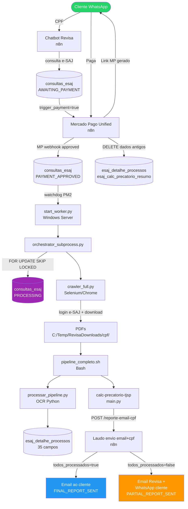
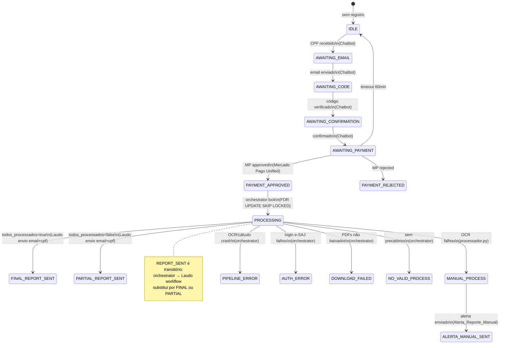
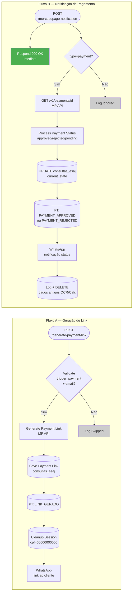
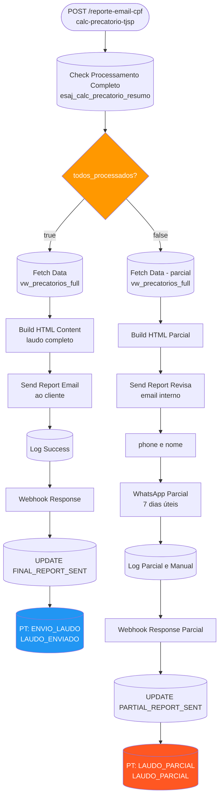
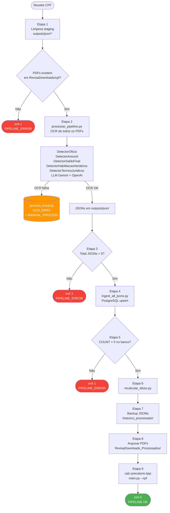
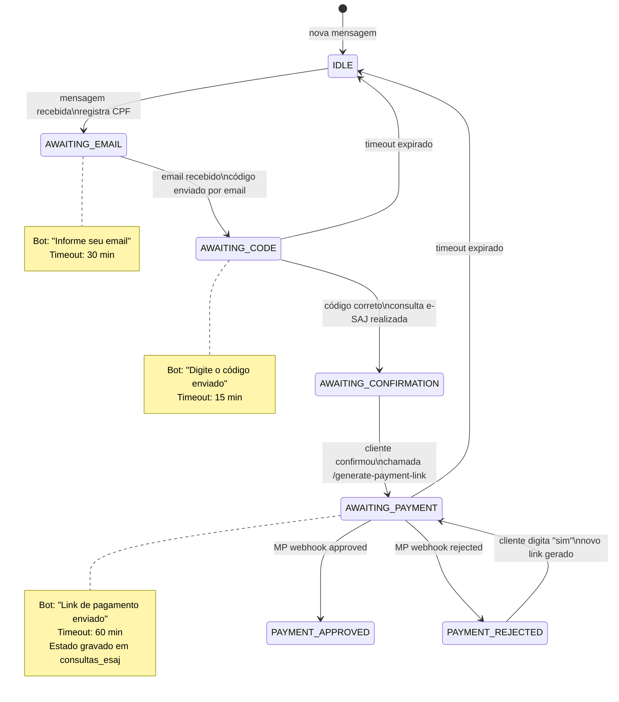

# Diagramas Mermaid — Pipeline Revisa Precatório

---

## 1. Pipeline Completo (Visão de Ponta a Ponta)

---

## 2. Máquina de Estados — `consultas_esaj.current_state`

---

## 3. Workflow: Mercado Pago Unified

---

## 4. Workflow: Laudo envio email+cpf

---

## 5. Workflows de Alerta (Agendados — a cada 10 min)

```mermaid
flowchart LR
    subgraph "Alerta_Laudo_Parcial (ATIVO)"
        SC1([Schedule 10min]) --> Q1[(Query: LAUDO_PARCIAL\nsem PARCIAL_INFORMADO)]
        Q1 --> PM1[Prepara Mensagens]
        PM1 --> E1[Email contato@revisa]
        E1 --> E2[Email persival + rodrigo]
        E2 --> PT1[(Insert PARCIAL_INFORMADO\nprocess_tracking)]
        PT1 --> L1[(Log n8n)]
    end

    subgraph "Alerta_Reporte_Manual (ATIVO)"
        SC2([Schedule 10min]) --> Q2[(Query: current_state\n= MANUAL_PROCESS)]
        Q2 --> PM2[Prepara Mensagens]
        PM2 --> WA[WhatsApp Cliente\n7 dias úteis]
        WA --> E3[Email contato@revisa]
        E3 --> E4[Email persival + rodrigo]
        E4 --> UPD[(UPDATE ALERTA_MANUAL_SENT\nconsultas_esaj)]
        UPD --> L2[(Log n8n)]
    end

    subgraph "Alerta_PDF_antigo (INATIVO ⚠️)"
        SC3([Schedule 10min]) -. DESABILITADO .-> Q3[(Query: MANUAL_PROCESS\nidêntica ao Reporte_Manual)]
        Q3 -. DESABILITADO .-> PM3[Prepara Mensagens]
    end

    style SC3 fill:#ccc,stroke-dasharray:5
    style Q3 fill:#ccc,stroke-dasharray:5
    style PM3 fill:#ccc,stroke-dasharray:5
```

---

## 6. OCR Pipeline Interno (pipeline_completo.sh)

---

## 7. Chatbot Revisa — Máquina de Estados Conversacional

